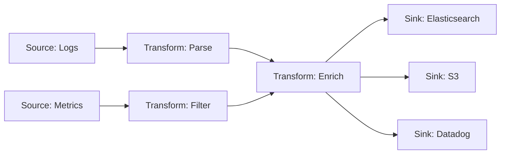

Vector's pipeline model is built on a directed acyclic graph (DAG) topology where data flows from **sources** through **transforms** to **sinks**. This flexible architecture enables complex routing, transformation, and aggregation patterns while maintaining high performance and reliability.

## Pipeline Architecture

### Core Concepts

A Vector pipeline consists of three component types connected in a graph:



<CardGroup cols={3}>
  <Card title="Sources" icon="arrow-right-to-bracket" href="/concepts/sources">
    Ingest data from external systems (files, syslog, APIs, etc.)
  </Card>
  <Card title="Transforms" icon="wand-magic-sparkles" href="/concepts/transforms">
    Process, parse, filter, and route events through the pipeline
  </Card>
  <Card title="Sinks" icon="arrow-right-from-bracket" href="/concepts/sinks">
    Send data to external systems (databases, object storage, SaaS platforms)
  </Card>
</CardGroup>

## How Pipelines Work

### Component Tasks

Vector runs each component as an asynchronous Tokio task:

1. **Sources** generate events and send them to downstream components
2. **Transforms** receive events, process them, and forward results
3. **Sinks** receive events and deliver them to external systems

Components are connected via channels (in-memory or disk-backed buffers) that handle backpressure and flow control.

### Event Flow

When Vector starts, it:

1. Parses and validates the configuration file
2. Builds each component (source, transform, sink)
3. Creates channels between components based on `inputs` declarations
4. Spawns each component as an independent async task
5. Wires components together via message-passing channels
6. Begins processing events

### Example Pipeline

Here's a simple pipeline that reads Apache logs, parses them, and routes to multiple destinations:

```yaml
# Read Apache access logs
sources:
  apache_logs:
    type: file
    include:
      - /var/log/apache2/access.log

# Parse logs into structured data
transforms:
  parse_apache:
    type: remap
    inputs:
      - apache_logs
    source: |
      . = parse_apache_log!(.message)
  
  # Filter out health checks
  filter_healthchecks:
    type: filter
    inputs:
      - parse_apache
    condition: '.path != "/health"'
  
  # Route by status code
  route_by_status:
    type: route
    inputs:
      - filter_healthchecks
    route:
      errors: '.status >= 400'
      success: '.status < 400'

# Send errors to alerting system
sinks:
  alert_errors:
    type: datadog_logs
    inputs:
      - route_by_status.errors
    endpoint: https://http-intake.logs.datadoghq.com
    default_api_key: "${DD_API_KEY}"
  
  # Archive all logs to S3
  archive_all:
    type: aws_s3
    inputs:
      - route_by_status._unmatched
      - route_by_status.success
      - route_by_status.errors
    bucket: my-log-archive
    compression: gzip
    encoding:
      codec: json
```

## Topology Graph

### Directed Acyclic Graph (DAG)

Vector enforces a DAG structure, which means:

- Events flow in one direction (no cycles)
- Components can have multiple inputs and outputs
- The same event can be sent to multiple destinations
- No component can receive data from its own output (directly or indirectly)

<Note>
  Vector validates your configuration at startup to ensure no cycles exist. Circular dependencies will cause Vector to fail to start with a clear error message.
</Note>

### Component Inputs

Every transform and sink specifies its `inputs` as a list of upstream components:

```yaml
transforms:
  my_transform:
    type: remap
    inputs:
      - source_one
      - source_two
      - another_transform
    source: |
      .processed = true
```

Multiple inputs are merged into a single stream before processing.

### Component Outputs

Most components have a single, unnamed output. Some components support multiple named outputs:

**Route transform** - Sends events to different named outputs:
```yaml
transforms:
  split_by_level:
    type: route
    inputs:
      - logs
    route:
      error: '.level == "error"'
      warning: '.level == "warning"'
      info: '.level == "info"'

sinks:
  error_sink:
    type: console
    inputs:
      - split_by_level.error  # Named output
```

**Sources with multiple outputs** - Some sources emit different event types:
```yaml
sources:
  internal_metrics:
    type: internal_metrics
    # Outputs: default (metrics)

sinks:
  metrics_out:
    type: prometheus_exporter
    inputs:
      - internal_metrics  # Automatically uses default output
```

### Fanout (Multiple Destinations)

Vector uses "fanout" to send the same event to multiple downstream components:

```yaml
sources:
  app_logs:
    type: file
    include:
      - /var/log/app/*.log

transforms:
  parse_logs:
    type: remap
    inputs:
      - app_logs
    source: |
      . = parse_json!(.message)

# Same parsed logs go to three destinations
sinks:
  elasticsearch:
    type: elasticsearch
    inputs:
      - parse_logs
    endpoint: http://elasticsearch:9200
  
  s3_archive:
    type: aws_s3
    inputs:
      - parse_logs
    bucket: logs-archive
  
  datadog:
    type: datadog_logs
    inputs:
      - parse_logs
    endpoint: https://http-intake.logs.datadoghq.com
```

Each sink receives an independent copy of the event. If one sink is slow or fails, it doesn't affect the others (when buffering is properly configured).

## Backpressure and Flow Control

Vector implements intelligent backpressure to handle downstream slowness:

### How Backpressure Works

1. When a sink is slow or a buffer fills up, it stops accepting new events
2. This backpressure propagates upstream through transforms
3. Eventually reaches sources, which slow down or stop reading new data
4. When the slow component catches up, flow resumes automatically

### Backpressure Strategies

Vector components can be configured with different backpressure behaviors:

<Tabs>
  <Tab title="Block (Default)">
    Wait for space to become available. This ensures no data loss but may cause slowdowns.
    
    ```yaml
    sinks:
      my_sink:
        type: elasticsearch
        buffer:
          type: memory
          max_events: 500
          when_full: block  # Default: wait for space
    ```
  </Tab>
  
  <Tab title="Drop Newest">
    Drop new events when buffer is full. This prioritizes throughput over completeness.
    
    ```yaml
    sinks:
      best_effort:
        type: datadog_logs
        buffer:
          type: memory
          max_events: 1000
          when_full: drop_newest  # Lose events rather than slow down
    ```
  </Tab>
</Tabs>

<Warning>
  Using `drop_newest` can result in data loss. Only use this mode when performance is more critical than completeness, such as for sampling or non-critical metrics.
</Warning>

## Concurrency and Parallelism

### Transform Concurrency

Some transforms support concurrent processing:

```yaml
transforms:
  parse_logs:
    type: remap
    inputs:
      - logs
    source: |
      . = parse_json!(.message)
      .enriched = get_enrichment_table!("geoip", [.ip_address])
    # Concurrency is automatically enabled for eligible transforms
```

Vector automatically:
- Spawns multiple tasks for CPU-intensive transforms
- Maintains event ordering when required
- Distributes work across available CPU cores

### Sink Concurrency

Sinks can process batches in parallel:

```yaml
sinks:
  http_out:
    type: http
    uri: https://api.example.com/logs
    request:
      concurrency: 10  # Process up to 10 requests simultaneously
```

## Dynamic Topology Changes

Vector supports live configuration reloads without dropping events:

### Reload Process

1. Vector receives a reload signal (SIGHUP or API call)
2. Parses and validates the new configuration
3. Computes a diff between old and new topologies
4. Gracefully shuts down removed components
5. Starts new components
6. Reconfigures existing components that changed
7. Rewires connections between components

### What Can Be Changed

<AccordionGroup>
  <Accordion title="Safe changes (no disruption)">
    - Adding new sources, transforms, or sinks
    - Removing components
    - Changing transform logic
    - Modifying sink destinations
    - Adjusting buffer sizes
  </Accordion>
  
  <Accordion title="Changes requiring restart">
    - Changing global data directory
    - Modifying API settings (address, TLS)
    - Some source types that maintain persistent connections
  </Accordion>
  
  <Accordion title="Persistent components">
    - Disk buffers survive reloads and restarts
    - Checkpoint data (file positions, offsets) is preserved
    - In-flight events are drained before component shutdown
  </Accordion>
</AccordionGroup>

## Topology Validation

Vector performs extensive validation on your configuration:

### Startup Validation

- **Syntax validation**: YAML/TOML parsing and structure
- **Schema validation**: Component types and required fields
- **Reference validation**: All inputs must reference existing components
- **Cycle detection**: No circular dependencies in the graph
- **Type compatibility**: Metrics can't flow into log-only sinks
- **Output validation**: Named outputs must exist on referenced components

### Example Validation Errors

```bash
# Missing input reference
ERROR: Transform 'parse_logs' input 'unknown_source' does not exist

# Circular dependency
ERROR: Cycle detected in topology: transform_a -> transform_b -> transform_a

# Type mismatch
ERROR: Sink 'log_sink' only accepts log events, but receives metrics from 'host_metrics'
```

## Advanced Patterns

### Sampling and Load Shedding

Reduce data volume with sampling:

```yaml
transforms:
  sample_logs:
    type: sample
    inputs:
      - high_volume_logs
    rate: 10  # Keep 1 in every 10 events

sinks:
  sampled_destination:
    type: elasticsearch
    inputs:
      - sample_logs
```

### Aggregation and Reduction

Combine multiple events into aggregates:

```yaml
transforms:
  aggregate_metrics:
    type: aggregate
    inputs:
      - raw_metrics
    interval_ms: 60000  # Aggregate every 60 seconds
    aggregate:
      name: "requests_per_minute"
      kind: counter
```

### Conditional Routing

Route events based on content:

```yaml
transforms:
  route_by_environment:
    type: route
    inputs:
      - all_logs
    route:
      production: '.environment == "production"'
      staging: '.environment == "staging"'
      development: '.environment == "development"'

sinks:
  prod_sink:
    type: datadog_logs
    inputs:
      - route_by_environment.production
  
  dev_sink:
    type: console
    inputs:
      - route_by_environment.development
      - route_by_environment.staging
```

## Observability

Vector emits internal metrics about pipeline health:

### Built-in Metrics

- `component_received_events_total` - Events received by each component
- `component_sent_events_total` - Events sent by each component
- `component_errors_total` - Errors encountered
- `buffer_received_events_total` - Events entering buffers
- `buffer_sent_events_total` - Events leaving buffers

### Monitoring Your Pipeline

```yaml
sources:
  vector_metrics:
    type: internal_metrics

sinks:
  prometheus:
    type: prometheus_exporter
    inputs:
      - vector_metrics
    address: 0.0.0.0:9598
```

Access metrics at `http://localhost:9598/metrics`.

## Best Practices

<AccordionGroup>
  <Accordion title="Design for failure">
    - Configure appropriate buffers for all sinks
    - Use disk buffers for critical data paths
    - Monitor buffer utilization and backpressure
    - Set up health checks for downstream systems
  </Accordion>
  
  <Accordion title="Optimize topology">
    - Parse and transform data as early as possible
    - Place expensive operations after filtering
    - Use route transforms to split traffic before expensive sinks
    - Consider sampling high-volume, low-value data
  </Accordion>
  
  <Accordion title="Test configuration changes">
    - Use `vector validate` to check config before deployment
    - Test transforms with `vector vrl` REPL
    - Monitor metrics after configuration reloads
    - Keep previous configurations for rollback
  </Accordion>
  
  <Accordion title="Maintain clear data flow">
    - Use descriptive component names
    - Document complex routing logic
    - Avoid deeply nested transforms when possible
    - Group related components with naming conventions
  </Accordion>
</AccordionGroup>

## Related Topics

- [Data Model](/concepts/data-model) - Understanding event types
- [Sources](/concepts/sources) - Ingesting data
- [Transforms](/concepts/transforms) - Processing events
- [Sinks](/concepts/sinks) - Sending data to destinations
- [Buffering](/concepts/buffering) - Managing backpressure and reliability