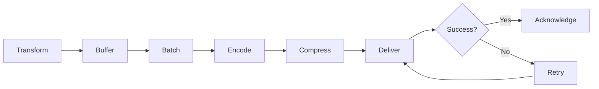

Sinks are Vector components that deliver events to external systems. They are the final stage in your Vector pipeline, sending logs, metrics, and traces to databases, object storage, SaaS platforms, and other destinations. Vector includes 40+ built-in sinks for common integrations.

## How Sinks Work

Sinks receive events from sources and transforms, then:

1. **Buffer** events in memory or on disk
2. **Batch** events for efficient delivery
3. **Encode** events in the destination's required format
4. **Compress** data to reduce network usage (optional)
5. **Deliver** events to the destination via network protocols
6. **Retry** failed deliveries with exponential backoff
7. **Acknowledge** successful delivery (when acknowledgements are enabled)

### Sink Architecture



## Sink Categories

### Cloud Platform Sinks

<CardGroup cols={3}>
  <Card title="AWS" icon="aws">
    S3, CloudWatch Logs/Metrics, Kinesis, SQS, SNS
  </Card>
  <Card title="Google Cloud" icon="google">
    Cloud Storage, Cloud Logging, Pub/Sub, BigQuery
  </Card>
  <Card title="Azure" icon="microsoft">
    Blob Storage, Monitor Logs, Event Hubs
  </Card>
</CardGroup>

**Example: AWS S3 sink**

```yaml
sinks:
  s3_archive:
    type: aws_s3
    inputs:
      - parsed_logs
    region: us-east-1
    bucket: my-log-archive
    key_prefix: "logs/date=%Y-%m-%d/"
    compression: gzip
    encoding:
      codec: json
    batch:
      max_bytes: 10485760    # 10MB per file
      timeout_secs: 300       # Or 5 minutes, whichever comes first
```

**Example: AWS CloudWatch Logs**

```yaml
sinks:
  cloudwatch:
    type: aws_cloudwatch_logs
    inputs:
      - application_logs
    region: us-east-1
    group_name: /aws/application/prod
    stream_name: "{{ host }}-{{ application }}"  # Dynamic stream names
    encoding:
      codec: json
```

### Observability Platforms

<CardGroup cols={2}>
  <Card title="Datadog" icon="dog">
    Unified observability platform for logs, metrics, and traces
  </Card>
  <Card title="New Relic" icon="chart-line">
    Full-stack observability and APM
  </Card>
  <Card title="Splunk" icon="fire">
    Enterprise log management and SIEM
  </Card>
  <Card title="Elastic" icon="magnifying-glass">
    Elasticsearch for search and analytics
  </Card>
</CardGroup>

**Example: Datadog logs and metrics**

```yaml
sinks:
  datadog_logs:
    type: datadog_logs
    inputs:
      - application_logs
    default_api_key: "${DD_API_KEY}"
    endpoint: https://http-intake.logs.datadoghq.com
    compression: gzip
  
  datadog_metrics:
    type: datadog_metrics
    inputs:
      - host_metrics
    default_api_key: "${DD_API_KEY}"
    endpoint: https://api.datadoghq.com
```

**Example: Elasticsearch**

```yaml
sinks:
  elasticsearch:
    type: elasticsearch
    inputs:
      - structured_logs
    endpoint: https://elasticsearch.example.com:9200
    auth:
      strategy: basic
      user: elastic
      password: "${ES_PASSWORD}"
    bulk:
      index: "logs-%Y.%m.%d"  # Daily indices
      action: create
    encoding:
      codec: json
    buffer:
      type: disk
      max_size: 268435488     # 256MB disk buffer
```

### Metrics Systems

<CardGroup cols={2}>
  <Card title="Prometheus" icon="chart-simple">
    Prometheus remote write and exporter
  </Card>
  <Card title="InfluxDB" icon="database">
    Time-series database for metrics
  </Card>
  <Card title="Graphite" icon="chart-area">
    Classic metrics storage system
  </Card>
  <Card title="StatsD" icon="signal">
    StatsD protocol for metrics aggregation
  </Card>
</CardGroup>

**Example: Prometheus Remote Write**

```yaml
sinks:
  prometheus:
    type: prometheus_remote_write
    inputs:
      - application_metrics
    endpoint: https://prometheus.example.com/api/v1/write
    default_namespace: app
    auth:
      strategy: bearer
      token: "${PROM_TOKEN}"
```

**Example: Prometheus Exporter**

```yaml
sinks:
  prometheus_exporter:
    type: prometheus_exporter
    inputs:
      - vector_metrics
    address: 0.0.0.0:9598
    default_namespace: vector
    # Metrics available at http://localhost:9598/metrics
```

### Databases

<CardGroup cols={2}>
  <Card title="ClickHouse" icon="database">
    Columnar database for analytics
  </Card>
  <Card title="PostgreSQL" icon="database">
    Relational database (via COPY protocol)
  </Card>
</CardGroup>

**Example: ClickHouse**

```yaml
sinks:
  clickhouse:
    type: clickhouse
    inputs:
      - structured_logs
    endpoint: http://clickhouse:8123
    database: logs
    table: application_logs
    skip_unknown_fields: false
    encoding:
      codec: json
    batch:
      max_events: 10000
      timeout_secs: 10
```

### Message Queues

<CardGroup cols={2}>
  <Card title="Kafka" icon="k">
    Distributed streaming platform
  </Card>
  <Card title="NATS" icon="paper-plane">
    Lightweight messaging system
  </Card>
  <Card title="AMQP" icon="rabbit">
    RabbitMQ and AMQP protocol
  </Card>
  <Card title="Redis" icon="r">
    In-memory data store with pub/sub
  </Card>
</CardGroup>

**Example: Kafka**

```yaml
sinks:
  kafka:
    type: kafka
    inputs:
      - events
    bootstrap_servers: kafka1:9092,kafka2:9092,kafka3:9092
    topic: "logs-{{ environment }}"
    key_field: request_id
    encoding:
      codec: json
    compression: snappy
    batch:
      timeout_secs: 1
    acknowledgements:
      enabled: true
```

### HTTP and Webhooks

**Example: Generic HTTP sink**

```yaml
sinks:
  http_endpoint:
    type: http
    inputs:
      - logs
    uri: https://api.example.com/logs
    method: post
    encoding:
      codec: json
    headers:
      Authorization: "Bearer ${API_TOKEN}"
      Content-Type: "application/json"
    batch:
      max_events: 100
    request:
      retry_attempts: 5
      retry_initial_backoff_secs: 1
      retry_max_duration_secs: 300
```

### Development and Testing

<CardGroup cols={2}>
  <Card title="console" icon="terminal">
    Print events to stdout (debugging)
  </Card>
  <Card title="blackhole" icon="trash">
    Discard events (testing throughput)
  </Card>
  <Card title="file" icon="file">
    Write to local files
  </Card>
</CardGroup>

**Example: Console output**

```yaml
sinks:
  debug:
    type: console
    inputs:
      - logs
    encoding:
      codec: json
      json:
        pretty: true
```

## Sink Configuration

### Common Options

All sinks support these configuration options:

```yaml
sinks:
  my_sink:
    type: <sink_type>
    inputs:
      - source_or_transform
    
    # Buffering configuration
    buffer:
      type: memory              # memory or disk
      max_events: 500           # For memory buffers
      max_size: 268435488       # For disk buffers (256MB)
      when_full: block          # block or drop_newest
    
    # Batching configuration
    batch:
      max_events: 100           # Max events per batch
      max_bytes: 1048576        # Max bytes per batch (1MB)
      timeout_secs: 5           # Max time to wait for batch
    
    # Encoding
    encoding:
      codec: json               # json, text, protobuf, etc.
      except_fields:
        - sensitive_field       # Exclude these fields
      only_fields:
        - field1                # Only include these fields
        - field2
    
    # Compression
    compression: gzip           # gzip, zstd, snappy, none
    
    # Request/delivery settings
    request:
      concurrency: 5            # Parallel requests
      retry_attempts: 5
      retry_initial_backoff_secs: 1
      retry_max_duration_secs: 300
      timeout_secs: 60
    
    # Acknowledgements
    acknowledgements:
      enabled: false            # Wait for delivery confirmation
    
    # Health checks
    healthcheck:
      enabled: true             # Check connectivity at startup
```

### Buffering Strategies

<Tabs>
  <Tab title="Memory Buffers (Default)">
    Fast, low-latency buffering in RAM. Suitable for most use cases.
    
    ```yaml
    sinks:
      my_sink:
        buffer:
          type: memory
          max_events: 500       # Buffer up to 500 events
          when_full: block      # Backpressure when full
    ```
    
    **Pros**: Fast, low overhead
    **Cons**: Data loss on crash, limited capacity
  </Tab>
  
  <Tab title="Disk Buffers">
    Persistent buffering for reliability and larger capacity.
    
    ```yaml
    sinks:
      critical_sink:
        buffer:
          type: disk
          max_size: 1073741824  # 1GB on disk
          when_full: block
    ```
    
    **Pros**: No data loss on crash, large capacity, survives restarts
    **Cons**: Slower, more I/O overhead
    
    See [Buffering](/concepts/buffering) for details.
  </Tab>
</Tabs>

### Batching

Batching improves throughput by sending multiple events together:

```yaml
sinks:
  elasticsearch:
    batch:
      max_events: 100           # Send when 100 events collected
      max_bytes: 1048576        # Or when 1MB of data
      timeout_secs: 5           # Or after 5 seconds
    # First condition met triggers the batch
```

**Tuning guidelines:**
- **Higher max_events**: Better throughput, higher latency
- **Lower timeout_secs**: Lower latency, more network requests
- **Larger max_bytes**: More compression efficiency

### Encoding Formats

Sinks support multiple encoding formats:

<Tabs>
  <Tab title="JSON">
    ```yaml
    sinks:
      json_sink:
        encoding:
          codec: json
          json:
            pretty: false       # Compact JSON
    ```
  </Tab>
  
  <Tab title="Text/Template">
    ```yaml
    sinks:
      text_sink:
        encoding:
          codec: text
          text:
            template: '{{ timestamp }} {{ level }} {{ message }}'
    ```
  </Tab>
  
  <Tab title="Logfmt">
    ```yaml
    sinks:
      logfmt_sink:
        encoding:
          codec: logfmt
    ```
  </Tab>
  
  <Tab title="CSV">
    ```yaml
    sinks:
      csv_sink:
        encoding:
          codec: csv
          csv:
            fields:
              - timestamp
              - level
              - message
    ```
  </Tab>
</Tabs>

### Compression

Compress data before transmission to reduce bandwidth:

```yaml
sinks:
  compressed_sink:
    compression: gzip           # gzip (most compatible)
    # compression: zstd         # zstd (better compression)
    # compression: snappy       # snappy (fastest)
    # compression: none         # no compression
```

**Compression comparison:**
- **gzip**: Best compatibility, good compression
- **zstd**: Best compression ratio, fast decompression
- **snappy**: Fastest, moderate compression
- **none**: No CPU overhead, more bandwidth

### Health Checks

Sinks run health checks at startup to verify connectivity:

```yaml
sinks:
  checked_sink:
    healthcheck:
      enabled: true             # Default: true
    # If healthcheck fails:
    # - Vector logs an error
    # - Vector may refuse to start (configurable globally)
```

Disable globally:
```yaml
# vector.yaml
healthchecks:
  enabled: false                # Skip all health checks
  require_healthy: false        # Don't block startup on failures
```

## Reliability and Delivery Guarantees

### Acknowledgements

Acknowledgements provide end-to-end delivery confirmation:

```yaml
sources:
  kafka_source:
    type: kafka
    acknowledgements:
      enabled: true             # Don't commit offsets until ack

transforms:
  process:
    type: remap
    inputs: [kafka_source]
    source: |
      . = parse_json!(.message)

sinks:
  elasticsearch:
    type: elasticsearch
    inputs: [process]
    acknowledgements:
      enabled: true             # Ack only after ES confirms write
```

**When to use:**
- Financial data
- Audit logs
- Compliance-required data

**Trade-offs:**
- Higher latency (wait for confirmation)
- More memory (track in-flight events)
- Better reliability (no data loss on sink failure)

<Note>
  Both the source and sink must have acknowledgements enabled for end-to-end delivery guarantees.
</Note>

### Retry Logic

Sinks automatically retry failed deliveries:

```yaml
sinks:
  resilient_sink:
    request:
      retry_attempts: 5                   # Try up to 5 times
      retry_initial_backoff_secs: 1       # Start with 1s delay
      retry_max_duration_secs: 300        # Give up after 5 minutes
    # Exponential backoff: 1s, 2s, 4s, 8s, 16s
```

**Retry triggers:**
- Network errors (connection refused, timeouts)
- HTTP 429 (rate limiting)
- HTTP 5xx (server errors)

**Not retried:**
- HTTP 4xx (except 429) - client errors
- Authentication failures
- Malformed requests

### Error Handling

When all retries are exhausted:

1. Event is dropped
2. Error is logged
3. `component_errors_total` metric is incremented
4. Downstream acknowledgements fail (if enabled)

To prevent data loss:
- Use disk buffers for critical sinks
- Enable acknowledgements
- Configure dead letter queues (DLQ):

```yaml
sinks:
  primary:
    type: elasticsearch
    # ... config ...
  
  # Send failures to S3 for later reprocessing
  dlq:
    type: aws_s3
    inputs:
      - primary._undeliverable  # Special output (future feature)
```

## Performance Optimization

### Concurrency

Increase parallel requests for better throughput:

```yaml
sinks:
  high_throughput:
    type: http
    request:
      concurrency: 20           # 20 parallel requests
    batch:
      max_events: 100
      timeout_secs: 1
```

**Guidelines:**
- Start with low concurrency (5-10)
- Increase until destination is saturated
- Monitor destination metrics (CPU, response time)
- Consider destination rate limits

### Batching

Larger batches improve throughput:

```yaml
sinks:
  optimized:
    batch:
      max_events: 1000          # Large batches for high throughput
      max_bytes: 10485760       # 10MB
      timeout_secs: 10          # Accept higher latency
```

### Compression

For remote sinks, compression usually helps:

```yaml
sinks:
  remote:
    compression: gzip
    # Reduces network usage by 70-90%
    # Adds ~5-10ms CPU overhead
```

### Network Tuning

```yaml
sinks:
  tuned:
    request:
      timeout_secs: 60          # Match destination latency
      rate_limit_num: 100       # Max 100 requests...
      rate_limit_duration_secs: 1  # ...per second
```

## Best Practices

<AccordionGroup>
  <Accordion title="Use appropriate buffers">
    - **Memory**: Fast path for non-critical data
    - **Disk**: Critical data, large buffers, unstable networks
    
    ```yaml
    sinks:
      audit_logs:
        buffer:
          type: disk            # Critical data
          max_size: 1073741824
      
      debug_logs:
        buffer:
          type: memory          # Best effort
          max_events: 500
    ```
  </Accordion>
  
  <Accordion title="Monitor sink health">
    Watch these metrics:
    - `component_sent_events_total`: Events delivered
    - `component_errors_total`: Delivery failures
    - `buffer_events`: Buffer utilization
    - `request_duration_seconds`: Delivery latency
    
    ```yaml
    sources:
      metrics:
        type: internal_metrics
    
    sinks:
      prometheus:
        type: prometheus_exporter
        inputs: [metrics]
        address: 0.0.0.0:9598
    ```
  </Accordion>
  
  <Accordion title="Configure appropriate timeouts">
    Match timeouts to destination characteristics:
    - Fast APIs: 10-30 seconds
    - Slow APIs: 60-120 seconds
    - Batch uploads: 300+ seconds
  </Accordion>
  
  <Accordion title="Use templates for dynamic routing">
    ```yaml
    sinks:
      s3_dynamic:
        type: aws_s3
        bucket: logs
        key_prefix: "{{ environment }}/{{ application }}/date=%Y-%m-%d/"
    ```
  </Accordion>
  
  <Accordion title="Test before production">
    - Run health checks: `vector validate --config vector.yaml`
    - Test with `console` sink first
    - Use `blackhole` sink for performance testing
    - Monitor metrics during initial rollout
  </Accordion>
</AccordionGroup>

## Troubleshooting

### Events Not Reaching Destination

1. **Check sink health**:
   ```bash
   curl http://localhost:8686/health
   ```

2. **Review logs**:
   ```bash
   VECTOR_LOG=debug vector --config vector.yaml
   ```

3. **Verify network connectivity**:
   ```bash
   telnet api.example.com 443
   ```

4. **Check metrics**:
   ```bash
   curl http://localhost:8686/metrics | grep component_errors
   ```

### High Latency

- Reduce batch sizes
- Increase concurrency
- Check destination performance
- Consider regional endpoints (reduce network distance)

### Buffer Full / Backpressure

- Increase buffer size
- Add more sink instances (horizontal scaling)
- Sample high-volume data
- Optimize destination performance

### Authentication Errors

- Verify credentials in environment variables
- Check IAM roles/permissions (for cloud sinks)
- Ensure tokens haven't expired
- Review destination access logs

## Related Topics

- [Buffering](/concepts/buffering) - Understanding buffers and backpressure
- [Data Model](/concepts/data-model) - Event types and structure
- [Pipeline Model](/concepts/pipeline-model) - How sinks fit in topologies
- [Transforms](/concepts/transforms) - Preparing data before sinks