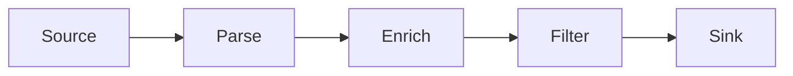

Transforms are Vector components that process events as they flow through your pipeline. They can parse, filter, enrich, aggregate, and route data between sources and sinks. Transforms are the core of Vector's data processing capabilities.

## How Transforms Work

Transforms sit between sources and sinks in Vector's topology:



Each transform:
1. **Receives** events from one or more inputs (sources or other transforms)
2. **Processes** events according to its configuration
3. **Emits** results to one or more outputs (other transforms or sinks)
4. **Handles** backpressure from downstream components

### Transform Types

<CardGroup cols={3}>
  <Card title="Parsing" icon="code">
    Extract structured data from raw text
  </Card>
  <Card title="Filtering" icon="filter">
    Select or discard events based on conditions
  </Card>
  <Card title="Routing" icon="route">
    Send events to different destinations
  </Card>
  <Card title="Enrichment" icon="plus">
    Add context and metadata
  </Card>
  <Card title="Aggregation" icon="layer-group">
    Combine multiple events
  </Card>
  <Card title="Conversion" icon="arrows-rotate">
    Change event types (logs ↔ metrics)
  </Card>
</CardGroup>

## Transform Categories

### Parsing and Structuring

<Accordion title="remap - Programmable transformation with VRL">
  The most powerful and commonly used transform. Uses Vector Remap Language (VRL) for complex event manipulation.
  
  ```yaml
  transforms:
    parse_logs:
      type: remap
      inputs:
        - raw_logs
      source: |
        # Parse JSON log message
        . = parse_json!(.message)
        
        # Extract timestamp
        .timestamp = parse_timestamp!(.time, "%Y-%m-%d %H:%M:%S")
        
        # Add environment tag
        .environment = "production"
        
        # Parse user agent
        .user_agent = parse_user_agent!(.user_agent_string)
        
        # Remove sensitive data
        del(.password)
        del(.api_key)
  ```
  
  **Use cases**: JSON parsing, log parsing, field extraction, data transformation, enrichment
</Accordion>

<Accordion title="regex_parser - Extract fields with regex">
  Extract structured fields using regular expressions. Less powerful than `remap` but simpler for basic parsing.
  
  ```yaml
  transforms:
    parse_apache:
      type: regex_parser
      inputs:
        - apache_logs
      regex: '^(?P<ip>\S+) \S+ (?P<user>\S+) \[(?P<timestamp>[^\]]+)\] "(?P<method>\S+) (?P<path>\S+) \S+" (?P<status>\d+) (?P<bytes>\d+)$'
      field: message
  ```
</Accordion>

<Accordion title="grok_parser - Parse with Grok patterns">
  Use Grok patterns (Logstash-compatible) for parsing common log formats.
  
  ```yaml
  transforms:
    grok_parse:
      type: grok_parser
      inputs:
        - logs
      pattern: '%{COMMONAPACHELOG}'
  ```
</Accordion>

### Filtering and Sampling

<Accordion title="filter - Keep or drop events">
  Keep or discard events based on conditions.
  
  ```yaml
  transforms:
    # Keep only errors
    errors_only:
      type: filter
      inputs:
        - parsed_logs
      condition: '.level == "error" || .status >= 400'
    
    # Drop health check logs
    no_healthchecks:
      type: filter
      inputs:
        - parsed_logs
      condition: '.path != "/health" && .path != "/ready"'
  ```
  
  **Use cases**: Reducing data volume, removing noise, isolating specific events
</Accordion>

<Accordion title="sample - Reduce data volume">
  Keep only a percentage of events for high-volume data.
  
  ```yaml
  transforms:
    sample_debug_logs:
      type: sample
      inputs:
        - debug_logs
      rate: 10              # Keep 1 in every 10 events
      key_field: request_id # Sample by request (optional)
  ```
  
  **Use cases**: Cost reduction, load testing, debugging high-traffic endpoints
</Accordion>

<Accordion title="dedupe - Remove duplicates">
  Remove duplicate events based on field values.
  
  ```yaml
  transforms:
    remove_dupes:
      type: dedupe
      inputs:
        - logs
      fields:
        match:
          - request_id
          - timestamp
      cache:
        num_events: 10000   # Remember last 10k events
  ```
</Accordion>

### Routing and Distribution

<Accordion title="route - Send events to different outputs">
  Route events to named outputs based on conditions.
  
  ```yaml
  transforms:
    route_by_severity:
      type: route
      inputs:
        - logs
      route:
        critical: '.level == "critical" || .level == "fatal"'
        errors: '.level == "error"'
        warnings: '.level == "warning"'
        info: '.level == "info"'
        # _unmatched: Everything else
  
  sinks:
    pagerduty_alerts:
      type: http
      inputs:
        - route_by_severity.critical
      uri: https://events.pagerduty.com/v2/enqueue
    
    elasticsearch_errors:
      type: elasticsearch
      inputs:
        - route_by_severity.errors
        - route_by_severity.warnings
    
    s3_archive:
      type: aws_s3
      inputs:
        - route_by_severity._unmatched  # Everything else
  ```
</Accordion>

<Accordion title="swimlanes - Parallel processing paths">
  Create parallel processing paths for different event types.
  
  ```yaml
  transforms:
    split_by_type:
      type: swimlanes
      inputs:
        - logs
      lanes:
        application:
          type: filter
          condition: '.source_type == "application"'
        system:
          type: filter
          condition: '.source_type == "system"'
  ```
</Accordion>

### Enrichment and Context

<Accordion title="remap with enrichment tables">
  Add external data from enrichment tables (CSV, databases).
  
  ```yaml
  enrichment_tables:
    geoip:
      type: geoip
      path: /usr/share/GeoIP/GeoLite2-City.mmdb
    
    user_data:
      type: file
      file:
        path: /etc/vector/users.csv
        encoding:
          type: csv
      schema:
        user_id: integer
        name: string
        department: string
  
  transforms:
    enrich_logs:
      type: remap
      inputs:
        - logs
      source: |
        # Add GeoIP data
        .geo = get_enrichment_table_record!("geoip", {
          "ip": .ip_address
        })
        
        # Add user information
        .user = get_enrichment_table_record!("user_data", {
          "user_id": .user_id
        })
  ```
</Accordion>

<Accordion title="lua - Custom logic with Lua">
  Write custom transformation logic in Lua.
  
  ```yaml
  transforms:
    custom_logic:
      type: lua
      inputs:
        - logs
      version: "2"
      hooks:
        process: |
          function process(event, emit)
            -- Custom Lua logic
            event.log.processed = true
            event.log.custom_field = calculate_something(event.log.value)
            emit(event)
          end
  ```
  
  **Note**: VRL (via `remap`) is preferred over Lua for better performance and type safety.
</Accordion>

### Aggregation and Reduction

<Accordion title="reduce - Merge events by key">
  Combine multiple events into a single aggregate event.
  
  ```yaml
  transforms:
    merge_by_request:
      type: reduce
      inputs:
        - logs
      group_by:
        - request_id
      merge_strategies:
        timestamp: min       # Keep earliest timestamp
        status: max          # Keep highest status code
        duration: sum        # Sum all durations
        messages: array      # Collect all messages
      ends_when: '.status != null && .final == true'
      expire_after_ms: 30000  # Flush after 30s
  ```
  
  **Use cases**: Combining fragmented logs, request/response pairing, transaction assembly
</Accordion>

<Accordion title="aggregate - Create metrics from logs">
  Convert log events into aggregate metrics.
  
  ```yaml
  transforms:
    log_to_metrics:
      type: aggregate
      inputs:
        - parsed_logs
      interval_ms: 60000    # Aggregate every minute
      aggregates:
        - name: requests_per_endpoint
          kind: counter
          tags:
            endpoint: "{{ path }}"
            method: "{{ method }}"
            status: "{{ status }}"
  ```
</Accordion>

### Type Conversion

<Accordion title="log_to_metric - Extract metrics from logs">
  Convert log events into metrics.
  
  ```yaml
  transforms:
    extract_metrics:
      type: log_to_metric
      inputs:
        - access_logs
      metrics:
        - type: counter
          field: request_count
          name: http_requests_total
          namespace: app
          tags:
            method: "{{ method }}"
            status: "{{ status }}"
        
        - type: histogram
          field: duration_ms
          name: http_request_duration_milliseconds
          namespace: app
  ```
</Accordion>

<Accordion title="metric_to_log - Convert metrics to logs">
  Convert metric events into log events.
  
  ```yaml
  transforms:
    metrics_as_logs:
      type: metric_to_log
      inputs:
        - host_metrics
      host_tag: host
      timezone: local
  ```
</Accordion>

### Specialized Transforms

<CardGroup cols={2}>
  <Card title="throttle" icon="gauge-high">
    Rate limit events to prevent overwhelming downstream systems
  </Card>
  <Card title="tag_cardinality_limit" icon="hashtag">
    Prevent cardinality explosion in metric tags
  </Card>
</CardGroup>

<Accordion title="throttle - Rate limiting">
  Control event throughput to prevent overwhelming downstream systems.
  
  ```yaml
  transforms:
    rate_limit:
      type: throttle
      inputs:
        - high_volume_logs
      threshold: 1000       # Max events per window
      window_secs: 1        # Per second
      key_field: client_id  # Rate limit per client
  ```
</Accordion>

<Accordion title="tag_cardinality_limit - Protect metrics">
  Prevent cardinality explosion by limiting unique tag combinations.
  
  ```yaml
  transforms:
    protect_metrics:
      type: tag_cardinality_limit
      inputs:
        - app_metrics
      limit_exceeded_action: drop_tag
      mode: probabilistic
      value_limit: 1000     # Max unique values per tag
  ```
</Accordion>

## Transform Behavior

### Synchronous vs. Asynchronous

**Synchronous transforms** (e.g., `filter`, `remap`):
- Process events immediately
- Maintain event order
- Support concurrent processing for performance
- Most common type

**Asynchronous transforms** (e.g., `reduce`, `aggregate`):
- Process events over time windows
- May reorder events
- Require internal state management
- Used for aggregation and stateful operations

### Multiple Outputs

Some transforms support multiple named outputs:

```yaml
transforms:
  route_logs:
    type: route
    inputs:
      - logs
    route:
      errors: '.level == "error"'
      warnings: '.level == "warning"'
      # _unmatched: implicit output for unmatched events

# Reference specific outputs
sinks:
  error_sink:
    inputs:
      - route_logs.errors
  
  warning_sink:
    inputs:
      - route_logs.warnings
  
  other_sink:
    inputs:
      - route_logs._unmatched
```

## Vector Remap Language (VRL)

VRL is Vector's purpose-built language for event transformation. It's the recommended way to process events.

### VRL Features

- **Type-safe**: Compile-time type checking prevents runtime errors
- **Fast**: Compiled to efficient bytecode
- **Ergonomic**: Designed specifically for event processing
- **Infallible**: Fallible operations use `!` to handle errors explicitly

### Common VRL Patterns

<CodeGroup>
```yaml Parse JSON
transforms:
  parse:
    type: remap
    source: |
      . = parse_json!(.message)
```

```yaml Parse timestamps
transforms:
  parse_time:
    type: remap
    source: |
      .timestamp = parse_timestamp!(.time, "%Y-%m-%d %H:%M:%S")
```

```yaml Extract with regex
transforms:
  extract_fields:
    type: remap
    source: |
      parsed = parse_regex!(.message, r'^(?P<level>\w+): (?P<msg>.+)$')
      .level = parsed.level
      .message = parsed.msg
```

```yaml Conditionals
transforms:
  conditional:
    type: remap
    source: |
      if .status >= 500 {
        .severity = "critical"
      } else if .status >= 400 {
        .severity = "error"
      } else {
        .severity = "info"
      }
```

```yaml Array operations
transforms:
  arrays:
    type: remap
    source: |
      # Parse CSV
      .tags = split(.tags_string, ",")
      
      # Filter array
      .filtered = filter(.items) -> |_index, value| {
        value > 10
      }
      
      # Map array
      .doubled = map(.numbers) -> |_index, value| {
        value * 2
      }
```
</CodeGroup>

### VRL Error Handling

```yaml
transforms:
  safe_parsing:
    type: remap
    source: |
      # Fallible operations use ! to handle errors
      parsed, err = parse_json(.message)
      if err != null {
        .parse_error = err
        .parsed = false
      } else {
        . = parsed
        .parsed = true
      }
```

<Tip>
  Test VRL expressions interactively with the `vector vrl` REPL:
  ```bash
  vector vrl
  ```
</Tip>

## Performance Optimization

### Transform Ordering

Order transforms to minimize processing:

```yaml
# Good: Filter early, process less data
transforms:
  1_filter:
    type: filter
    inputs: [logs]
    condition: '.level != "debug"'
  
  2_parse:
    type: remap
    inputs: [1_filter]
    source: |
      . = parse_json!(.message)  # Only parse filtered events

# Bad: Parse everything, then filter
transforms:
  1_parse:
    type: remap
    inputs: [logs]
    source: |
      . = parse_json!(.message)  # Parse all events
  
  2_filter:
    type: filter
    inputs: [1_parse]
    condition: '.level != "debug"'  # Filter after expensive parsing
```

### Concurrent Processing

Vector automatically enables concurrency for eligible transforms. To maximize performance:

- Use `remap` over `lua` (VRL is faster and supports better concurrency)
- Avoid stateful operations when possible
- Use `route` to split traffic before expensive operations

### Memory Management

```yaml
transforms:
  # Reduce memory in aggregating transforms
  aggregate:
    type: reduce
    expire_after_ms: 5000  # Flush state frequently
  
  # Limit cache sizes
  dedupe:
    type: dedupe
    cache:
      num_events: 5000     # Smaller cache = less memory
```

## Best Practices

<AccordionGroup>
  <Accordion title="Transform early, route late">
    - Parse and structure data as early as possible
    - Filter out unnecessary data before expensive operations
    - Route to different destinations at the end of processing
  </Accordion>
  
  <Accordion title="Use VRL over Lua">
    VRL is faster, safer, and better integrated:
    - Type safety prevents runtime errors
    - Better performance through compilation
    - First-class support for Vector data types
    - Interactive REPL for testing
  </Accordion>
  
  <Accordion title="Handle errors explicitly">
    ```yaml
    transforms:
      safe_transform:
        type: remap
        drop_on_error: false  # Keep events even if VRL fails
        source: |
          parsed, err = parse_json(.message)
          if err == null {
            . = parsed
          }
    ```
  </Accordion>
  
  <Accordion title="Test transforms independently">
    Use unit tests for transform logic:
    
    ```yaml
    tests:
      - name: parse_apache_logs
        inputs:
          - insert_at: parse_logs
            value: '{"message": "127.0.0.1 - - [01/Jan/2024:00:00:00 +0000] GET /api HTTP/1.1 200"}'
        outputs:
          - extract_from: parse_logs
            conditions:
              - type: vrl
                source: '.ip == "127.0.0.1" && .status == 200'
    ```
  </Accordion>
  
  <Accordion title="Monitor transform performance">
    Watch internal metrics for bottlenecks:
    - `component_received_events_total`
    - `component_sent_events_total`
    - `component_errors_total`
    - `component_execution_time_seconds`
  </Accordion>
</AccordionGroup>

## Troubleshooting

### Events Not Flowing

1. Check transform condition logic
2. Verify input references are correct
3. Look for errors in VRL compilation
4. Enable debug logging: `VECTOR_LOG=debug`

### High Memory Usage

- Reduce cache sizes in `dedupe`
- Decrease expiration times in `reduce` and `aggregate`
- Add `sample` transforms for high-volume data
- Filter earlier in the pipeline

### VRL Errors

Use the VRL REPL to debug:
```bash
echo '{"message": "test", "level": "info"}' | vector vrl '. = parse_json!(.message)'
```

## Related Topics

- [VRL Reference](https://vrl.dev) - Complete VRL language documentation
- [Data Model](/concepts/data-model) - Understanding event structure
- [Pipeline Model](/concepts/pipeline-model) - How transforms fit in topologies
- [Sources](/concepts/sources) - Where events come from
- [Sinks](/concepts/sinks) - Where events go