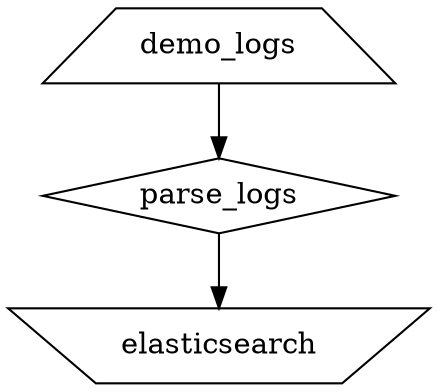
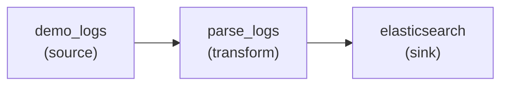

Vector provides several commands for validating, testing, and managing your observability pipeline configuration.

## validate

Validate the target configuration file(s), then exit.

### Usage

```bash
vector validate [OPTIONS] [CONFIG_FILES...]
```

### Options

<ParamField path="--no-environment" type="boolean">
  Disables environment checks, including component checks and health checks.
  
  ```bash
  vector validate --no-environment
  ```
</ParamField>

<ParamField path="--skip-healthchecks" type="boolean">
  Disables health checks during validation.
  
  ```bash
  vector validate --skip-healthchecks
  ```
</ParamField>

<ParamField path="-d, --deny-warnings" type="boolean">
  Fail validation on warnings that are probably a mistake or are recommended to be fixed.
  
  ```bash
  vector validate --deny-warnings
  ```
</ParamField>

<ParamField path="--config-*" type="string[]">
  Configuration file paths (supports `--config`, `--config-toml`, `--config-json`, `--config-yaml`, `--config-dir`).
</ParamField>

### Examples

```bash
# Validate a single config file
vector validate --config vector.yaml

# Validate multiple files
vector validate --config sources.yaml --config sinks.yaml

# Validate without running healthchecks
vector validate --skip-healthchecks --config vector.yaml

# Strict validation (fail on warnings)
vector validate --deny-warnings --config vector.yaml
```

### Output

**Success:**
```
✓ Loaded ["/etc/vector/vector.yaml"]
✓ Configuration is valid
```

**Error:**
```
✕ Configuration error
  × sources.demo_logs: unknown field `invalid_option`
```

---

## test

Run Vector config unit tests, then exit. This command is experimental and subject to change.

### Usage

```bash
vector test [OPTIONS] [CONFIG_FILES...]
```

### Options

<ParamField path="--config-*" type="string[]">
  Configuration file paths containing test definitions.
</ParamField>

<ParamField path="--junit-report" type="string[]">
  Output path(s) for JUnit XML test reports.
  
  ```bash
  vector test --junit-report results.xml
  ```
</ParamField>

### Examples

```bash
# Run tests in config file
vector test --config vector.yaml

# Run tests and generate JUnit report
vector test --config vector.yaml --junit-report test-results.xml
```

### Test Definition Format

Define unit tests in your configuration:

```yaml
tests:
  - name: check_grok_parsing
    input:
      insert_at: parse_logs
      value: '55.3.244.1 - - [01/Mar/2024:12:00:00 +0000] "GET /index.html HTTP/1.1" 200 2326'
    outputs:
      - extract_from: parse_logs
        conditions:
          - type: vrl
            source: |
              assert_eq!(.status, 200)
              assert_eq!(.method, "GET")
```

### Output

```
Running tests
test check_grok_parsing ... passed

test result: ok. 1 passed; 0 failed
```

<Note>
For detailed guidance on writing unit tests, see the [unit testing guide](https://vector.dev/guides/level-up/unit-testing/).
</Note>

---

## graph

Output the topology as a visual representation using the DOT or Mermaid language.

### Usage

```bash
vector graph [OPTIONS] [CONFIG_FILES...]
```

### Options

<ParamField path="--format" type="string">
  Output format: `dot` or `mermaid`. Default: `dot`.
  
  ```bash
  vector graph --format mermaid
  ```
</ParamField>

<ParamField path="--config-*" type="string[]">
  Configuration file paths.
</ParamField>

<ParamField path="--disable-env-var-interpolation" type="boolean">
  Disable interpolation of environment variables in configuration files.
</ParamField>

### Examples

```bash
# Generate DOT graph
vector graph --config vector.yaml > topology.dot

# Generate Mermaid graph
vector graph --format mermaid --config vector.yaml > topology.mmd

# Render with GraphViz
vector graph --config vector.yaml | dot -Tpng > topology.png

# View with xdot
vector graph --config vector.yaml | xdot -
```

### Output Example (DOT)



### Output Example (Mermaid)



<Tip>
Use [Mermaid Live Editor](https://mermaid.live/) to visualize Mermaid diagrams or [GraphvizOnline](https://dreampuf.github.io/GraphvizOnline/) for DOT files.
</Tip>

---

## top

Display topology and metrics in the console for a local or remote Vector instance.

<Note>
This command requires the `top` feature to be enabled at compile time.
</Note>

### Usage

```bash
vector top [OPTIONS] [URL]
```

### Arguments

<ParamField path="URL" type="string">
  Vector GraphQL API endpoint. Default: `http://127.0.0.1:8686/graphql`.
  
  ```bash
  vector top http://localhost:8686/graphql
  vector top http://remote-vector:8686/graphql
  ```
</ParamField>

### Options

<ParamField path="--refresh-interval" type="integer">
  Refresh interval in milliseconds. Default: 1000.
  
  ```bash
  vector top --refresh-interval 500
  ```
</ParamField>

### Examples

```bash
# Monitor local Vector instance
vector top

# Monitor remote instance
vector top http://10.0.0.5:8686/graphql

# Monitor with faster refresh
vector top --refresh-interval 500
```

### Display

The `top` command displays an interactive dashboard showing:

- Component topology
- Events processed per second
- Bytes processed per second  
- Error counts
- Component status

**Navigation:**
- `Tab` - Switch between components
- `q` - Quit
- `r` - Refresh

---

## generate

Generate a Vector configuration containing a list of components.

### Usage

```bash
vector generate [OPTIONS] <EXPRESSION>
```

### Arguments

<ParamField path="EXPRESSION" type="string" required>
  Generate expression in the format: `sources/transforms/sinks`.
  
  Components are separated by commas, types by forward slashes.
  
  ```bash
  # Just a source
  vector generate "stdin"
  
  # Source and sink
  vector generate "stdin//console"
  
  # Full pipeline
  vector generate "demo_logs/remap,filter/elasticsearch,console"
  
  # With custom names
  vector generate "logs:demo_logs/parser:remap/out:console"
  ```
</ParamField>

### Options

<ParamField path="-f, --fragment" type="boolean">
  Skip generation of global fields.
  
  ```bash
  vector generate --fragment "demo_logs/remap/console"
  ```
</ParamField>

<ParamField path="--file" type="string">
  Write configuration to a file instead of stdout.
  
  ```bash
  vector generate --file vector.yaml "demo_logs//console"
  ```
</ParamField>

<ParamField path="--format" type="string">
  Output format: `yaml`, `toml`, or `json`. Default: `yaml`.
  
  ```bash
  vector generate --format toml "demo_logs//console"
  ```
</ParamField>

### Examples

```bash
# Generate a simple stdin to console pipeline
vector generate "stdin//console"

# Generate with transforms
vector generate "demo_logs/remap,filter/elasticsearch"

# Generate with custom names
vector generate "input:file/parser:remap/output:http"

# Save to file in TOML format
vector generate --file config.toml --format toml "demo_logs//console"
```

### Expression Format

The expression format is:

```
[name:]source[,[name:]source...]/[name:]transform[,[name:]transform...]/[name:]sink[,[name:]sink...]
```

Examples:
- `/filter` - Just a filter transform
- `//file,http` - Just file and http sinks
- `stdin//http` - stdin source and http sink
- `foo:stdin/bar:remap/baz:console` - Named components

### Output Example

```yaml
data_dir: /var/lib/vector

sources:
  source1:
    type: demo_logs
    format: json
    interval: 1.0

transforms:
  transform1:
    type: remap
    inputs:
      - source1
    source: |
      # Add your VRL code here
      . = .

sinks:
  sink1:
    type: console
    inputs:
      - transform1
    encoding:
      codec: json
```

---

## list

List available components, then exit.

### Usage

```bash
vector list [OPTIONS]
```

### Options

<ParamField path="--format" type="string">
  Output format: `text`, `json`, or `avro`. Default: `text`.
  
  ```bash
  vector list --format json
  ```
</ParamField>

### Examples

```bash
# List all components
vector list

# List in JSON format
vector list --format json
```

### Output Example (Text)

```
Sources:
- demo_logs
- exec
- file
- http
- kafka
- kubernetes_logs
- prometheus_scrape
- stdin
- syslog

Transforms:
- aggregate
- dedupe
- filter
- remap
- route
- sample
- throttle

Sinks:
- aws_cloudwatch_logs
- aws_s3
- console
- elasticsearch
- file
- http
- kafka
- prometheus_exporter
- splunk_hec

Enrichment tables:
- file
- geoip
- mmdb
```

### Output Example (JSON)

```json
{
  "sources": [
    "demo_logs",
    "file",
    "http",
    "kafka"
  ],
  "transforms": [
    "filter",
    "remap",
    "route"
  ],
  "sinks": [
    "console",
    "elasticsearch",
    "http"
  ],
  "enrichment_tables": [
    "geoip",
    "mmdb"
  ]
}
```

---

## convert-config

Convert a config file from one format to another. Can walk directories recursively and convert all discovered config files.

<Warning>
This is a best-effort conversion. Comments are not preserved, and explicitly set default values may be omitted.
</Warning>

### Usage

```bash
vector convert-config [OPTIONS] <INPUT_PATH> <OUTPUT_PATH>
```

### Arguments

<ParamField path="INPUT_PATH" type="string" required>
  Input file or directory path.
</ParamField>

<ParamField path="OUTPUT_PATH" type="string" required>
  Output file or directory path. Must not exist.
</ParamField>

### Options

<ParamField path="--output-format" type="string">
  Target format: `yaml`, `toml`, or `json`. Default: `yaml`.
  
  ```bash
  vector convert-config --output-format toml input.yaml output.toml
  ```
</ParamField>

### Examples

```bash
# Convert single file from TOML to YAML
vector convert-config vector.toml vector.yaml

# Convert to JSON
vector convert-config --output-format json vector.yaml vector.json

# Convert entire directory
vector convert-config --output-format yaml /etc/vector/old/ /etc/vector/new/
```

### Notes

- Input format is detected from file extension
- Output format defaults to YAML unless specified
- Directory conversion processes all `.toml`, `.json`, `.yaml`, and `.yml` files
- Output path must not exist (safety check)
- Comments and formatting are not preserved

---

## Additional Commands

### vrl

Vector Remap Language interactive CLI for testing VRL expressions.

```bash
vector vrl
```

Opens an interactive REPL for testing VRL code. See the [VRL documentation](https://vector.dev/docs/reference/vrl/) for details.

### tap

Observe output log events from source or transform components. Logs are sampled at a specified interval.

<Note>
Requires the `api-client` feature to be enabled.
</Note>

```bash
vector tap [OPTIONS] [URL] [COMPONENT_ID]
```

Example:
```bash
vector tap http://localhost:8686/graphql demo_logs
```

---

## Exit Codes

All commands use standard exit codes:

- `0` - Success
- `1` - Generic error  
- `78` - Configuration error

## See Also

<CardGroup cols={2}>
  <Card title="CLI Overview" icon="terminal" href="/reference/cli/overview">
    Global options and runtime configuration
  </Card>
  <Card title="Configuration" icon="gear" href="/configuration/overview">
    Learn how to configure Vector
  </Card>
  <Card title="VRL Reference" icon="code" href="/reference/vrl/overview">
    Vector Remap Language reference
  </Card>
</CardGroup>